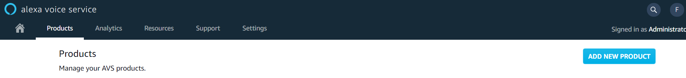

## Diedrich_Alexa
Trabalho final da disciplina de Microcontroladores

### Motivação
Com o avanço da tecnologia, principalmente de conectividade e dispositivos inteligentes, é cada vez mais comum ver a atuação de assistentes virtuais no seu dia a dia. Duas grandes referencias de assistentes virtuais são a Alexa (Amazon) e Siri (Apple). No caso da Amazon, foi desenvolvido um equipamento chamado de Echo, que basicamente se torna um ouvinte do ambiente aguardando novos comandos, alguns exemplos são:
* Perguntas em geral, como: Horário, Clima, Próximos compromissos
* Comandos ativos: Marcar um evento na agenda, criar um lembrete, realizar uma ligação
* Comandos de IOT: Ligar a luz do quarto, reproduzir uma playlist na casa

### Descrição do projeto
Dado essa introdução sobre assistentes virtuais e o dispositivo Echo da Amazon, podemos enunciar a motivação do projeto como sendo:

>**Desenvolvimento de um projeto com Alexa embarcada no microcontrolador STM32F746, que possa além de se comunicar com o assistente virtual, também realizar comandos utilizando os periféricos da placa.**

  

### Etapas do projeto

Devido a complexidade do projeto o trabalho foi dividido e 3 partes:
* Criação de ambiente
* Comunicação com a Nuvem
* Rotina

Neste repositorio será tratado a 2ª parte.

Dentro da subdivisão desse repositorio trataremos de:
1. Configuração do Ambiente com a Amazon
2. Comunicação entre placa e Amazon API

### Configuração do Ambiente com a Amazon (Parte 1)

Inicialmente se deve criar uma conta de desenvolvimento na plataforma da Amazon chamada Alexa Voice Service (AVS).

- Vá em console e adicione um novo projeto:

  

* Preencha todo o forumlário com as especificações do projeto e ao final você deverá ter:
  * Product Name
  * Product ID
  * Amazon ID

Esses dados serão utilizados em etapas posteriores do projeto.

### Comunicação entre placa e Amazon API (Parte 2)

